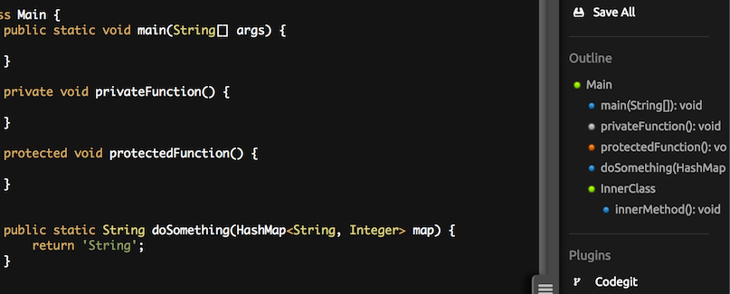
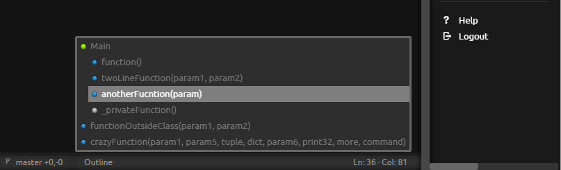

# YS-Outline
Code outline plugin for Codiad-IDE.  
This plugin builds a hierarchical tree representation of higher level items in the code such as classes and functions with the aim of providing a developer with the following benefits:  

* At a glance high level view of the content in a code file. 
* Simple navigation through the code by providing clickable links in the outline tree that point directly to the line where the item is defined.

### Supported Languages
Java, Python

## Installation
Download the zip file and extract it into your plugins folder.